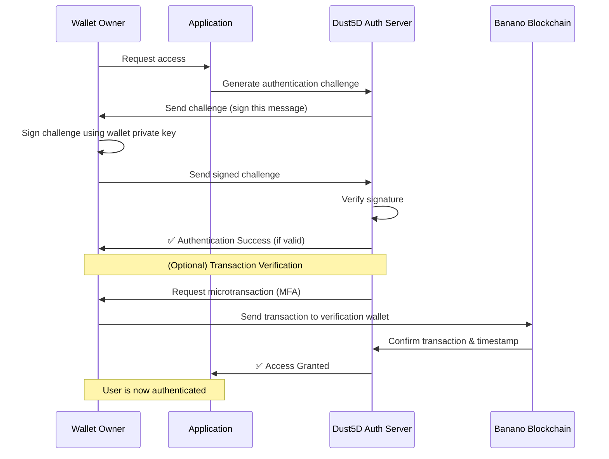

# Dust5D: Zero-Trust Authentication & Access Layer

## Overview
Dust5D introduces a **zero-trust authentication mechanism** using **Banano cryptographic message signing & microtransactions** to establish a **decentralized, trust-based access layer**. This system eliminates the need for **usernames, passwords, centralized authentication providers**, and **vulnerable MFA methods**.

## Core Components
### 1. **Identity & Authentication**
- **Wallet-based authentication**: Users authenticate using their **Banano wallet private key**.
- **Message signing**: The authentication process relies on **cryptographic signatures** rather than static credentials.
- **Microtransaction-based MFA**: Users optionally **confirm identity** by sending a tiny transaction to a designated verification wallet.

### 2. **Trust & Access Control**
- **Challenge-response validation** ensures only the wallet owner can authenticate.
- **Access Control Lists (ACLs)** determine **who is allowed** into a system.
- **Decentralized endpoints** allow anyone to host their own **access nodes**, eliminating a central point of failure.

---

## **Authentication Sequence**

---

## **Security Considerations**

### **1. Why is this Secure?**
- ✅ **No passwords**: Removes risk of phishing, credential leaks.
- ✅ **Private key stays secure**: Only signatures are shared, never the private key.
- ✅ **On-chain verification**: Provides **non-repudiable** proof of authentication.
- ✅ **Zero-trust architecture**: Every session requires fresh authentication.

### **2. Preventing Attacks**
- **Spoofing Attempts**: Impossible since only the wallet owner can produce a valid signature.
- **Bot Attacks**: Bots lack the private key to sign authentication challenges.
- **Session Hijacking**: Tokens are ephemeral; transactions timestamp authentication.
- **Denial of Service (DoS)**: Decentralized nodes distribute load, preventing single-point failures.

### **3. Future Enhancements**
- **Federated trust layers**: Interoperable with multiple crypto networks.
- **Hierarchical permissions**: Fine-grained ACLs for multi-tiered access control.
- **Smart contract integration**: Enabling automated permission grants & revocations.

---

## **Implementation Details**
### **1. Cryptographic Signing Process**
- **Challenge Format**: `Dust5D Authentication: [Wallet Address] [Timestamp]`
- **Signature Algorithm**: Banano Ed25519 digital signatures
- **Verification**: Server verifies signature using Banano public key

### **2. Transaction-Based MFA (Optional)**
- **Step 1**: Auth server requests a **microtransaction** (e.g., `0.00000005484 BAN`).
- **Step 2**: User sends the **exact amount** to a pre-defined verification wallet.
- **Step 3**: Server checks Banano blockchain for the **matching transaction**.
- **Step 4**: If confirmed, **access is granted**.

---

## **Conclusion**
Dust5D redefines authentication by eliminating reliance on **centralized credentials**, **third-party identity providers**, and **password-based authentication models**. This **zero-trust, cryptographic-first system** ensures access is **fully decentralized, verifiable, and secure**.

🔥 **Welcome to the future of authentication.** 🚀

